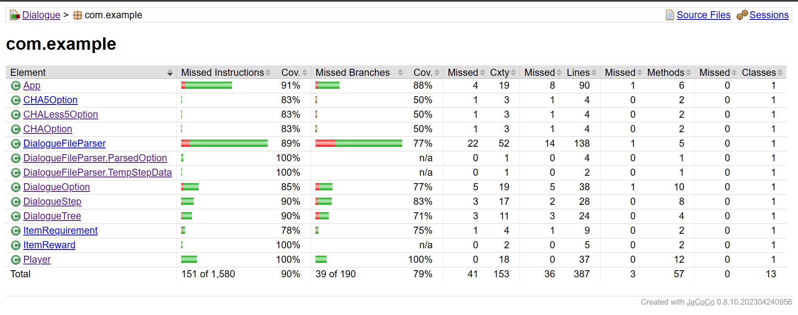

# Homework for Dialog tree structure in java + tests
(тестове виж надолу)

Успях да напиша тестове за играенето, което намирам за доста яко!
Вкарвах в стандартния input "натискания" на клавиатурата, за да симулариам играта
и по магия Maven го прие и теста мина - ако искате да видите си го пуснете с maven:
```bash
mvn clean compile && mvn clean test
```
<br><br>
Повреме да теста се показва как се играе.
<br><br>
Trust it works:
```bash
[INFO] --- exec-maven-plugin:3.5.0:java (default-cli) @ Dialogue ---
Running com.example.AppTest

Step ID: 2
NPC: Welcome to DunerLand!. How do I help you boss?
1. I want buy armor
2. I want to speak with the king
3. I have slain the dragon
4. SLAY DROGON!
Choose an option: 4
You got: [Dragon head]
Step ID: 3
NPC: Done, anything else?
Press enter to continue...

Step ID: 2
NPC: Welcome to DunerLand!. How do I help you boss?
1. I want buy armor
2. I want to speak with the king
3. I have slain the dragon
4. SLAY DROGON!
Choose an option: 3
You got: [Small bag of gold]
Step ID: 3
NPC: Done, anything else?
Press enter to continue...

Step ID: 2
NPC: Welcome to DunerLand!. How do I help you boss?
1. I want buy armor
2. I want to speak with the king
3. I have slain the dragon
4. SLAY DROGON!
Choose an option: 1
You got: [Small bag of gold]
Step ID: 1
NPC: I have some armors
2. Give me Light armor and dont cheat!
Choose an option: 2
You got: [Light armor]
Dialogue ended.


Results :

Tests run: 16, Failures: 0, Errors: 0, Skipped: 0

[INFO]
[INFO] --- jacoco-maven-plugin:0.8.10:report (report) @ Dialogue ---
[INFO] Loading execution data file /home/bananc/Documents/java/Dialogue/target/jacoco.exec
[INFO] Analyzed bundle 'Dialogue' with 13 classes
[INFO] ------------------------------------------------------------------------
[INFO] BUILD SUCCESS
[INFO] ------------------------------------------------------------------------
[INFO] Total time:  2.968 s
[INFO] Finished at: 2025-01-24T23:23:04+02:00
[INFO] ------------------------------------------------------------------------
```
<br><br>
### Test coverage:

